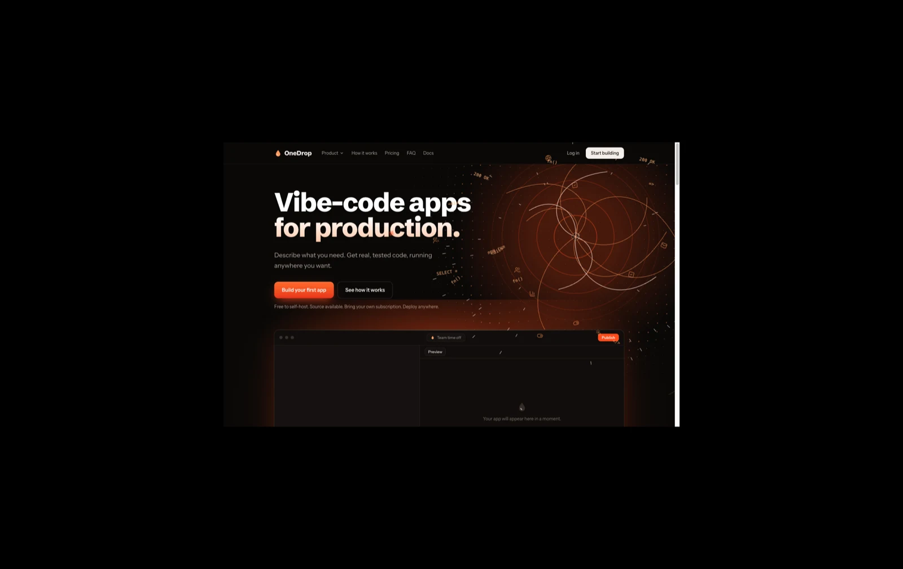
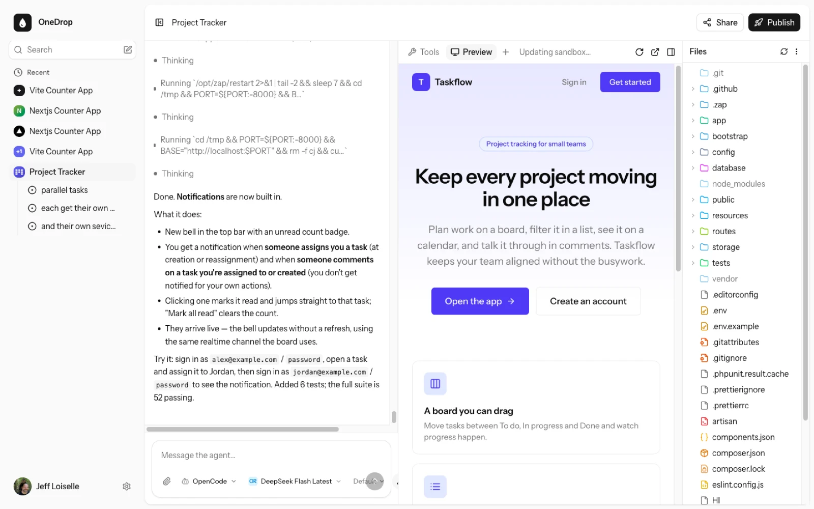
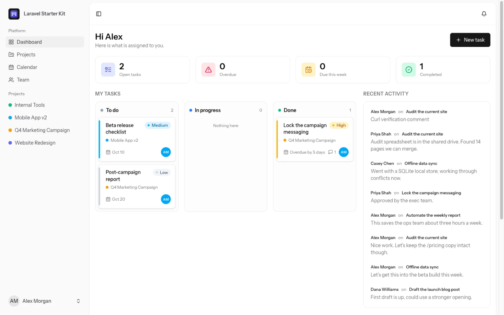
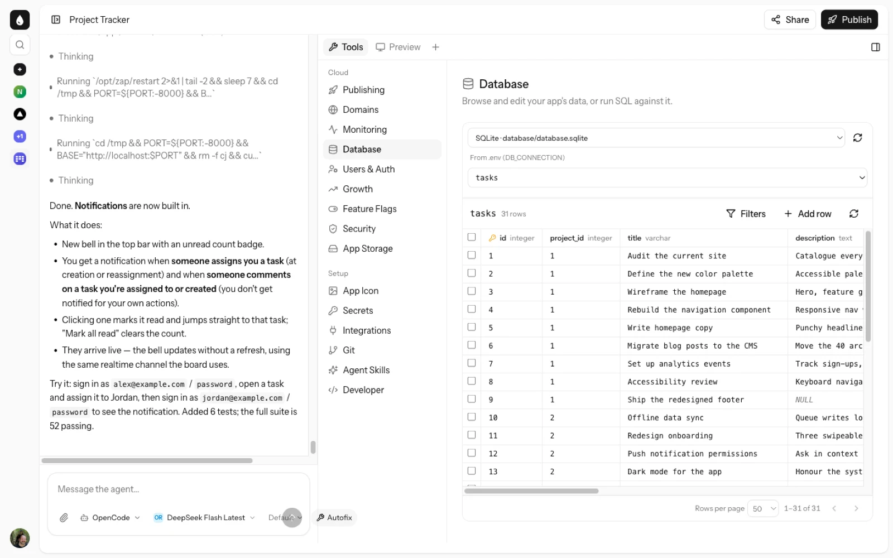
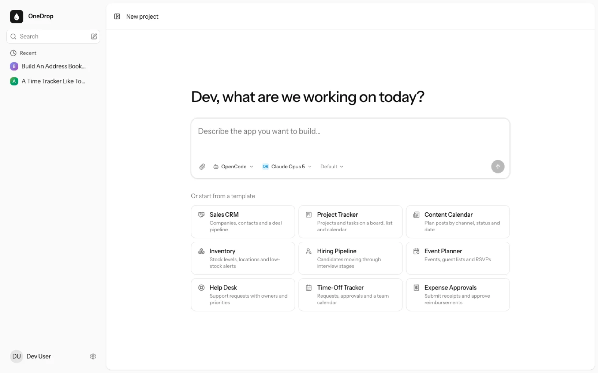
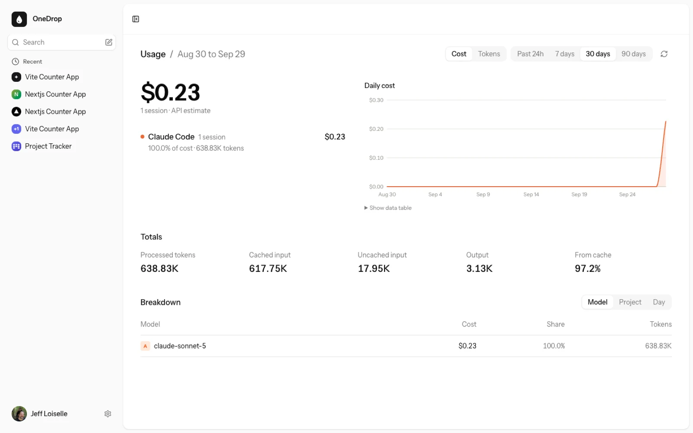
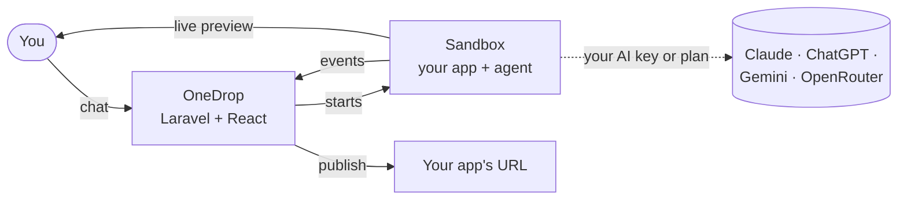

<p align="center">
  <a href="https://onedrop.io">
    <picture>
      <source media="(prefers-color-scheme: dark)" srcset="docs/logo/dark.svg">
      
    </picture>
  </a>
</p>

<h3 align="center">Vibe-code apps for production.</h3>

<p align="center">
  Describe what you need. An AI agent builds it as real, tested code, live next to the chat,<br>
  on your own AI subscription and your own servers.
</p>

<p align="center">
  <a href="LICENSE"></a>
  <a href="https://docs.onedrop.io/introduction"></a>
  
</p>

<p align="center">
  <a href="#install"><b>Install</b></a> ·
  <a href="https://docs.onedrop.io/introduction"><b>Docs</b></a> ·
  <a href="#features"><b>Features</b></a> ·
  <a href="#how-it-works"><b>How it works</b></a> ·
  <a href="#develop"><b>Develop</b></a>
</p>

<p align="center">
  
</p>

## Install

On macOS or Linux, with [Docker](https://www.docker.com/products/docker-desktop/) running:

```bash
curl -fsSL https://onedrop.io/install | sh
```

That's it. OneDrop opens at **http://localhost:8000**, and the first account you create is the admin.

| Command          | What it does                                                    |
| ---------------- | --------------------------------------------------------------- |
| `drop update`    | Get the latest version and restart. Your projects are kept.     |
| `drop stop`      | Stop OneDrop.                                                   |
| `drop uninstall` | Remove OneDrop. It asks before deleting your projects and data. |
| `drop help`      | Everything else: start, logs, open.                             |

> [!TIP]
> **Putting it on a server for your team?** Add a domain and you get HTTPS. `auto` uses a free `<ip>.sslip.io` address:
>
> ```bash
> curl -fsSL https://onedrop.io/install | sh -s -- --domain auto
> ```
>
> Works on [any Ubuntu 24.04 machine](https://docs.onedrop.io/self-hosting/install-anywhere), or [on AWS](https://docs.onedrop.io/self-hosting/deploy-aws) with Pulumi.

## Why OneDrop

Hosted app builders are great until you need to own the result. OneDrop gives you the same "type it and watch it appear" loop, on your terms.

|                                  | OneDrop                                                        | Typical hosted builder     |
| -------------------------------- | -------------------------------------------------------------- | -------------------------- |
| **Your AI**                      | Your ChatGPT, Claude, or API key. No credits, no markup.       | Their credits, their price |
| **Where it runs**                | Your laptop, any Ubuntu server, or AWS                         | Their cloud                |
| **What you get**                 | Standard React or Laravel code, with tests, in git             | Code tied to their stack   |
| **Built-in production plumbing** | Sign-in, database, secrets, storage, feature flags, monitoring | Varies, often add-ons      |
| **Price to self-host**           | Free, [source available](#license)                             | n/a                        |

## Features

### Chat on the left, your running app on the right

Every project gets its own sandbox. The agent reads, writes, and runs code there, and you watch each step in the chat while the app updates live in the preview. The files, a shell, and a console are one click away when you want them.



### Real apps, not mockups

The agent builds standard, reviewable code: React, or Laravel with a database when the app needs one. It writes tests and keeps them green. This project tracker, with a board, calendar, team, and live notifications, was built entirely from chat:



### Production tools, built in

Everything an app needs to go live sits next to the chat: **Database** browsing and SQL, **Users & Auth**, **Secrets**, **App Storage**, **Feature Flags**, **Monitoring**, **Growth** analytics, **Domains**, **Git**, and one-click **Publishing**.



### Start from a sentence, or a template

Type what you want, or pick a starter: CRM, project tracker, content calendar, inventory, hiring pipeline, help desk, and more. Choose your agent and model right in the prompt box.



### And a lot more

<table>
  <tr>
    <td width="50%" valign="top">
      <b>🧠 Bring your own AI</b><br>
      Build on your ChatGPT Plus or Pro plan, your Claude Pro or Max plan, or an API key for Anthropic, OpenAI, Google, or OpenRouter. <a href="https://docs.onedrop.io/guides/set-up-ai">Set up AI →</a>
    </td>
    <td width="50%" valign="top">
      <b>🤖 Pick your agent</b><br>
      Run <a href="https://opencode.ai">OpenCode</a> or <a href="https://docs.anthropic.com/en/docs/claude-code">Claude Code</a>, per project, with any model your provider offers.
    </td>
  </tr>
  <tr>
    <td valign="top">
      <b>🔀 Parallel tasks</b><br>
      Hand several agents their own tasks on one project. Each gets its own copy of the app, and you merge the results from a kanban board. <a href="https://docs.onedrop.io/guides/tasks">Tasks →</a>
    </td>
    <td valign="top">
      <b>🚀 Publish in one click</b><br>
      Give any project its own URL, private to your team or public, whatever framework it uses. <a href="https://docs.onedrop.io/guides/publish">Publish →</a>
    </td>
  </tr>
  <tr>
    <td valign="top">
      <b>🌱 Git all the way down</b><br>
      Every change is a commit. See history, restore an earlier version, branch, and push to GitHub. <a href="https://docs.onedrop.io/guides/git">Git →</a>
    </td>
    <td valign="top">
      <b>✨ Share and remix</b><br>
      Show off an app with a public page: your prompt, a screenshot, and a social card. Others can remix it. <a href="https://docs.onedrop.io/guides/share">Share →</a>
    </td>
  </tr>
  <tr>
    <td valign="top">
      <b>👥 Built for teams</b><br>
      Invite people, organize them into groups, and sign in with Google, GitHub, or Microsoft. <a href="https://docs.onedrop.io/guides/invite-people">Invite people →</a>
    </td>
    <td valign="top">
      <b>📊 See what it costs</b><br>
      Track tokens and spend by model, project, and day, so you're never surprised by your AI bill. <a href="https://docs.onedrop.io/guides/usage">Usage →</a>
    </td>
  </tr>
</table>



## How it works



1. **Connect your AI.** Sign in with ChatGPT or Claude, or paste an API key. [Guide](https://docs.onedrop.io/guides/set-up-ai)
2. **Describe your app.** OneDrop creates a project and a sandbox for it. [Guide](https://docs.onedrop.io/guides/build-a-project)
3. **Watch it get built.** The agent works in the sandbox; you see each step in the chat and the app in the preview.
4. **Share it.** Publish to give it its own URL. [Guide](https://docs.onedrop.io/guides/publish)

Sandboxes run in **Docker** on your machine, or on [Blaxel](https://blaxel.ai) or [Runtime Cloud](https://docs.onedrop.io/self-hosting/sandboxes) when you'd rather not run the containers yourself. Your AI credentials go to your provider, never to us. [Architecture →](https://docs.onedrop.io/development/architecture)

> [!NOTE]
> OneDrop is built for trusted teams: people in a company building internal tools without setting up a development environment. It isn't designed to host apps for anonymous strangers.

## Develop

Want to work on OneDrop itself? It's Laravel 13, Inertia + React, Tailwind, and Pest.

```bash
git clone https://github.com/onedrop-io/onedrop.git && cd onedrop
composer install && npm install
cp .env.example .env && php artisan key:generate
php artisan migrate:fresh --seed     # dev login: dev@example.com / password
php artisan sandbox:build-image      # the Docker image every project runs in
composer run dev                     # http://localhost:8000
```

Run the tests with `php artisan test`. Read [Contributing](https://docs.onedrop.io/development/contributing) for the house rules (every feature starts in [`SPEC.md`](SPEC.md) and ships with tests) and the [quickstart](https://docs.onedrop.io/quickstart) for the full setup.

<details>
<summary><b>Where things live</b></summary>

| Path                  | What's there                                                         |
| --------------------- | -------------------------------------------------------------------- |
| `app/Sandbox/`        | Sandbox providers (Docker, Blaxel, Runtime), agent runners           |
| `app/Jobs/`           | Creating sandboxes, running agents, publishing                       |
| `resources/js/pages/` | The React UI                                                         |
| `docker/sandbox/`     | The sandbox image, event forwarder, and host proxy                   |
| `infra/`              | Server bootstrap and AWS (Pulumi)                                    |
| `docs/`               | [docs.onedrop.io](https://docs.onedrop.io), in Mintlify              |
| `docs/plans/`         | Plans, including the original [build plan](docs/plans/build-plan.md) |

</details>

## License

[Elastic License 2.0](LICENSE) (ELv2). Use, change, and self-host OneDrop for your own team or company. You may not offer it to others as a hosted or managed service, circumvent any license key features, or remove the licensing notices. See [elastic.co/licensing/elastic-license](https://www.elastic.co/licensing/elastic-license).

<details>
<summary>Image credits</summary>

The planet maps in `public/images/earth`, `public/images/mars`, and `public/images/planets` are by [Solar System Scope](https://www.solarsystemscope.com/textures/), resized, under [CC BY 4.0](https://creativecommons.org/licenses/by/4.0/), not ELv2. The Moon maps in `public/images/moon` are by [NASA's Scientific Visualization Studio](https://svs.gsfc.nasa.gov/4720) (CGI Moon Kit), and the hurricane in `public/images/hurricane` is from a [NASA Earth Observatory](https://science.nasa.gov/earth/earth-observatory/hurricane-isabel-12116/) photo of Hurricane Isabel (Jeff Schmaltz, MODIS Land Rapid Response Team, NASA GSFC). The Voyager and Pioneer models (`public/images/voyager`, `public/images/pioneer`) are NASA's, the Golden Record photo is NASA/JPL's, and the Pioneer plaque drawing is a public-domain tracing by Oona Räisänen. Laniakea's galaxies (`public/images/laniakea`) are from the 2MASS Redshift Survey (Huchra et al. 2012), via VizieR. See the `CREDITS.md` in each folder.

</details>

<p align="center">
  <sub>Made with 🧡 and a lot of agents.</sub>
</p>
