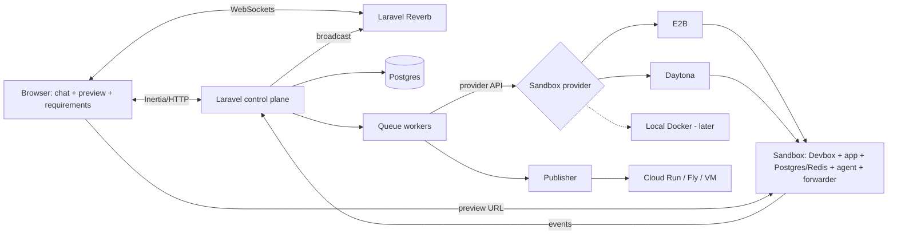

# OneDrop

**Vibe-code apps for production.** Bring your own subscription. Deploy anywhere. Free to self-host, source available.

## Install

On macOS or Linux, with [Docker](https://www.docker.com/products/docker-desktop/) running:

```bash
curl -fsSL https://raw.githubusercontent.com/onedrop-io/onedrop/main/install.sh | sh
```

This adds the `drop` command and starts OneDrop at `http://localhost:8000`. The first account you create is the admin. Run `drop help` to update, stop, or uninstall it.

- [Install guide](https://docs.onedrop.io/install)
- On a server, add a domain for HTTPS (`auto` uses a free `<ip>.sslip.io` address): `curl -fsSL https://raw.githubusercontent.com/onedrop-io/onedrop/main/install.sh | sh -s -- --domain auto`
- [Install on a server](https://docs.onedrop.io/self-hosting/install-anywhere) (any Ubuntu 24.04 machine) or [on AWS](https://docs.onedrop.io/self-hosting/deploy-aws)
- [Run from source](https://docs.onedrop.io/quickstart) to work on OneDrop itself
- [Documentation](https://docs.onedrop.io/introduction)

The rest of this file is the original build plan.

A source-available, self-hostable, Replit-style app builder. A person describes an app in chat, an AI coding agent builds it inside an isolated cloud sandbox, and the running app is live at a URL while they work. Every feature becomes a requirement with tests you can watch run.

The control plane is a Laravel application (Inertia + React). Sandboxes come from managed providers (E2B, Daytona) behind a small provider interface, so backends can be swapped without changing the platform. The reference deployment is Laravel Cloud; self-hosters run the same app with Docker Compose.

> **Status:** planning. This document is the build plan and is written to be handed to a coding agent. Work through the milestones in order; each has acceptance criteria. Milestone 0 verifies the assumptions the rest depends on. Do not skip it.

---

## Why this exists

Hosted builders (Replit, Lovable, bolt.new) give a great experience but lock you into their infrastructure, pricing, and usually one stack. Cloud coding agents (Claude Code on the web, Cursor cloud agents, Codex) run in sandboxes you cannot reach: they return screenshots or a pull request, never a live URL. Open-source attempts are locked to one stack (usually Next.js) or have stalled.

This project aims to be:

- **Any stack.** Sandbox packages come from Nix via Devbox, so PHP/Laravel is as easy as Node.
- **Live preview.** Every app is reachable at its own URL while the agent works on it.
- **Bring your own AI.** Each user signs in to their own coding-agent tool (Claude Code, Codex, OpenCode, ...).
- **Managed sandboxes first.** No container hosts to operate; sandboxes are API calls.
- **Spec-driven.** A living requirement library with tests tied to each requirement, viewable and replayable in the UI. No existing tool does this.

### Non-goals (for now)

- Multi-tenant hosting for untrusted strangers. Target users are trusted staff.
- Real-time multi-user editing of the same app.
- Replacing a production hosting platform. Published apps go to an existing cloud.

---

## Core concepts

| Concept             | What it is                                                                  |
| ------------------- | --------------------------------------------------------------------------- |
| **App**             | A project: a git repo plus a manifest, owned by a user.                     |
| **Manifest**        | Declares the stack: packages, services, start commands, ports.              |
| **Sandbox**         | An isolated environment at a provider, running one app in dev mode.         |
| **Provider**        | A sandbox backend (E2B, Daytona; later local Docker, AerolVM).              |
| **Agent session**   | A vendor coding-agent CLI running inside the sandbox on a task.             |
| **Event forwarder** | A small process in the sandbox that streams agent events to the platform.   |
| **Wake proxy**      | The route that resumes a paused sandbox when its URL is visited.            |
| **Publish**         | Builds a production image from the manifest and deploys it to a cloud.      |
| **Requirement**     | A user-facing capability with an ID, acceptance criteria, and linked tests. |

---

## Architecture



**The one rule that keeps PHP happy:** Laravel never holds a long-lived connection and never supervises a process. Everything long-running happens in the sandbox (the agent, the forwarder) or in a managed service (Reverb, queue workers, the provider). Laravel coordinates, stores, and broadcasts.

Dev sandboxes and published apps are deliberately separate, the same split Replit uses: sandboxes are stateful and pausable; published apps are stateless containers.

---

## Components

### 1. App manifest

Each app repo contains `devbox.json` (packages and services, standard Devbox format) and `app.yaml` (platform metadata). Devbox runs Postgres and Redis as services inside the sandbox, so one app is one sandbox.

```yaml
# app.yaml
name: timesheets
stack: laravel # informs agent instructions and publish build
dev:
    setup: composer install && npm install && php artisan migrate
    start: composer run dev # must bind 0.0.0.0
    port: 8000
publish:
    target: cloud-run
    build: dockerfile # or: nix
```

The agent may edit both files ("add Redis"); the platform rebuilds the sandbox environment when they change.

### 2. Sandbox provider interface

```php
interface SandboxProvider
{
    public function create(SandboxSpec $spec): Sandbox;
    public function start(string $id): void;
    public function pause(string $id): void;      // keep disk (and memory if supported)
    public function snapshot(string $id): string; // returns snapshot id
    public function restore(string $id, string $snapshotId): void;
    public function exec(string $id, Command $cmd): ExecResult;   // short commands only
    public function previewUrl(string $id, int $port): PreviewUrl; // url + auth details
    public function destroy(string $id): void;
}
```

Implementations, in order:

1. **`e2b`** and **`daytona`**: managed, per-second billing. Chosen by M0 results.
2. **`docker`** (later): local Docker for development and demos on a laptop, and the cheap self-host option.
3. **`aerolvm`** (experimental, later): self-hosted microVMs; young project, do not depend on it.

Selection criteria for any backend: pause/resume that preserves disk, resume time with a real Laravel stack running, idle cost, authentication on preview URLs, isolation level.

### 3. Agent runner and event forwarder

- Queue jobs start an agent session by running the vendor CLI inside the sandbox (via `exec` in detached mode). Adapters: `claude-code` (v1), `codex`, `opencode`.
- Each user authenticates with their own account inside their sandbox. The platform never pools subscriptions or holds vendor credentials.
- A **forwarder** process in the sandbox reads the agent's structured output (Claude Code `--output-format stream-json`) and POSTs events to a signed platform webhook. Laravel stores them and broadcasts over Reverb. No PHP process waits on a stream.
- After every agent task: git commit in the sandbox and a provider snapshot, so any change can be undone.

### 4. Agent instructions

Two layers:

- **Platform instructions**, written into the sandbox by the runner and not editable by the user: plain-language communication for non-developers; write the requirement and tests before code; keep all tests green; never rewrite a test linked to an approved requirement without approval; after each change check logs and the preview and fix errors before reporting; how to restart the dev server.
- **App instructions** in the repo's `AGENTS.md`. A one-line `CLAUDE.md` imports it (`@AGENTS.md`) so Claude Code and AGENTS.md-reading tools share one file.

### 5. Preview URLs and wake-on-request

- Every app has a stable platform URL: `https://<platform>/a/<app>` (later `<app>.<domain>`).
- The route checks sandbox status. Running: redirect or iframe to the provider preview URL. Paused: dispatch a resume job, render a "waking up" page, broadcast a `ready` event over Reverb, then load the preview.
- Provider preview URLs must be authenticated (token or provider auth). M0 confirms how.
- Idle handling relies on provider auto-pause timeouts, with a scheduled job as backup.

### 6. Control plane (Laravel)

- Laravel 12, Inertia, React, Tailwind. Postgres for all platform data.
- Front end is Inertia + React throughout. Livewire is not used in the platform or the default app template (Filament may be added later for an admin panel only).
- Auth: Laravel's built-in auth plus Socialite for SSO (Google Workspace, Microsoft, Okta via OIDC).
- Queues: Laravel Cloud managed queues (or Horizon + Redis when self-hosted). Jobs are short API calls; long waits are modeled as events, not sleeping jobs.
- Real-time: Laravel Reverb (managed on Laravel Cloud; a Reverb process when self-hosted).
- Scheduler: idle cleanup, snapshot pruning, cost accounting.
- Laravel Boost installed so coding agents working on the platform have framework docs and tools.

### 7. Web UI

- Default view for non-developers: chat on the left, live preview (iframe) on the right.
- "Advanced" toggle reveals files, terminal, logs, and diffs.
- Starter templates (tracker, form, dashboard) instead of an empty chat.
- Undo for every agent task; a Publish button that runs tests first.
- Later: click an element in the preview to reference it in chat.

### 8. Requirement library

Requirements live in the app repo:

```yaml
# requirements/timesheets.yaml
- id: TS-001
  title: Manager can approve a timesheet
  status: approved # draft | approved
  acceptance:
      - Approve button is visible to managers only
      - Approved timesheets are locked from editing
```

Tests reference IDs (Pest groups, e.g. `->group('TS-001')`). Browser tests use Pest's Playwright-backed browser testing with traces and video recorded. Test runs execute in the sandbox; results and trace files are uploaded to platform object storage.

The UI shows every requirement as passing, failing, or uncovered. Clicking one shows its tests, the last run's trace or video, and a button to run them now with live output. Approved acceptance criteria and their tests change only with human approval.

### 9. Publish

- Builds a production image from the manifest (generated Dockerfile first; Nix-built image later).
- Targets: Google Cloud Run first (scale to zero suits mostly idle internal apps); a single VM with Litestream for SQLite-based apps; Fly.io; AWS later.
- Apps must be stateless to publish to serverless targets: sessions/cache in the database or Redis, uploads in object storage, queue workers deployed separately.
- Publish runs the full test suite first and refuses on failure.

---

## Default stack for generated apps

Users can pick anything Nix provides, but the default is what most people will use:

- **Default:** Laravel + Inertia + React + Postgres + Pest. One app, one router, one deploy; auth, queues, and real-time built in; rich client-side pages via React.
- **Option:** SQLite instead of Postgres for small single-team tools (lighter sandbox, single-VM publish target).
- **Also first-class:** Next.js + Postgres.

---

## Hosting

**Reference deployment: Laravel Cloud.** App compute, managed Postgres, managed queue workers, managed Reverb, scheduler, and push-to-deploy. Keep one small web instance always on for production; hibernation is fine for dev instances. Choose the region closest to the sandbox provider's region.

**Self-hosted:** a `docker-compose.yml` with the app (PHP-FPM + Nginx or Octane), a queue worker, a Reverb process, the scheduler, Postgres, and Redis. Object storage via S3-compatible bucket or MinIO.

---

## Security baseline

- Trusted-staff model. Provider isolation (Firecracker at E2B, containers/VMs at Daytona) is acceptable for v1.
- No platform or production credentials in sandboxes. Per-app secrets are encrypted at rest and injected at sandbox start.
- Forwarder webhooks are signed per sandbox and expire with the session.
- All preview URLs authenticated; platform URLs behind login.
- This platform runs on infrastructure and networks separate from any system in scope for payments compliance.

---

## Milestones

Complete in order. Each milestone must meet its acceptance criteria before starting the next.

### M0: Verify assumptions (spikes, no platform code)

- Confirm for Claude Code, Codex, and OpenCode: whether headless/SDK use inside a sandbox is permitted and how it is billed under a personal subscription vs an API key. Record findings in `/docs/agent-billing.md`.
- On E2B and Daytona: start a sandbox from a Devbox template with Laravel + Postgres, pause it, resume it, and measure resume-to-first-response time. Confirm preview URL authentication options. Record in `/docs/provider-eval.md`.
- **Accept when:** both documents exist with measured numbers and a provider is chosen for v1.

### M1: Sandbox with a live URL

- `SandboxProvider` interface and the chosen provider implementation.
- Create sandbox from an app repo, install packages from `devbox.json`, start Postgres via Devbox services, run `dev.setup` and `dev.start`.
- Platform route serves the preview (running) or wake page (paused).
- **Accept when:** a fresh Laravel app with Postgres loads through the platform URL; pausing and resuming preserves code and database data; wake-on-request works with a measured, logged wake time.

### M2: Agent runner and chat UI

- Claude Code adapter runs inside the sandbox using the user's own login; forwarder streams events; Reverb broadcasts them.
- UI shows chat and the live preview side by side.
- Git commit plus snapshot after every agent task; undo button reverts.
- **Accept when:** a user types "build a to-do list with login" and sees the working app appear in the preview without touching a terminal, then undoes the last change successfully.

### M3: Requirement library (v1)

- Requirement files, test tagging convention, results and trace upload, UI view with replay.
- Platform instructions updated so the agent writes requirements and tests first.
- **Accept when:** asking for a new feature produces a draft requirement, the user approves it, linked tests are written and pass, and clicking the requirement replays its browser test.

### M4: Publish

- Generated Dockerfile build and deploy to Cloud Run.
- **Accept when:** the M2 to-do app publishes to an authenticated URL, and publish refuses when a test fails.

### M5: Second provider

- Implement the other managed provider, or local Docker, behind the same interface.
- **Accept when:** the same app runs unchanged on the new provider, selected by config only.

### M6: Self-host packaging

- `docker-compose.yml`, install docs, and a smoke test.
- **Accept when:** a fresh Linux VM runs the platform from the compose file and completes M2's acceptance test.

---

## Open questions

- Agent billing and terms for headless use per vendor (resolved by M0).
- Preview URL authentication per provider (resolved by M0).
- Whether preview URLs are shareable with coworkers, and how that is authorized.
- Promotion path from "staff prototype" to "reviewed production app": who approves, what gets checked.
- Cost accounting per user/app for sandbox time.

---

## Suggested repo layout

```
app/Sandbox/Providers/     e2b, daytona, docker (later)
app/Sandbox/Agents/        claude-code, codex, opencode adapters
app/Http/Controllers/      wake proxy, webhooks, Inertia pages
app/Jobs/                  create/resume/snapshot/run-agent/run-tests/publish
app/Requirements/          requirement parsing, test result ingestion
resources/js/              React UI (chat, preview, requirements)
sandbox/                   files placed in every sandbox: forwarder, platform instructions
templates/                 starter apps (laravel-inertia-react, nextjs)
docker/                    self-host compose and images
docs/                      architecture, decision records, M0 findings
```

## License

[Elastic License 2.0](LICENSE) (ELv2).

Use, change, and self-host OneDrop for your own team or company. You may not offer it to others as a hosted or managed service, circumvent any license key features, or remove the licensing notices. See [elastic.co/licensing/elastic-license](https://www.elastic.co/licensing/elastic-license).

The Earth and Mars maps in `public/images/earth` and `public/images/mars` are by [Solar System Scope](https://www.solarsystemscope.com/textures/), resized, under [CC BY 4.0](https://creativecommons.org/licenses/by/4.0/), not ELv2. The Moon maps in `public/images/moon` are by [NASA's Scientific Visualization Studio](https://svs.gsfc.nasa.gov/4720) (CGI Moon Kit), and the hurricane in `public/images/hurricane` is from a [NASA Earth Observatory](https://science.nasa.gov/earth/earth-observatory/hurricane-isabel-12116/) photo of Hurricane Isabel (Jeff Schmaltz, MODIS Land Rapid Response Team, NASA GSFC). See the `CREDITS.md` in each folder.
