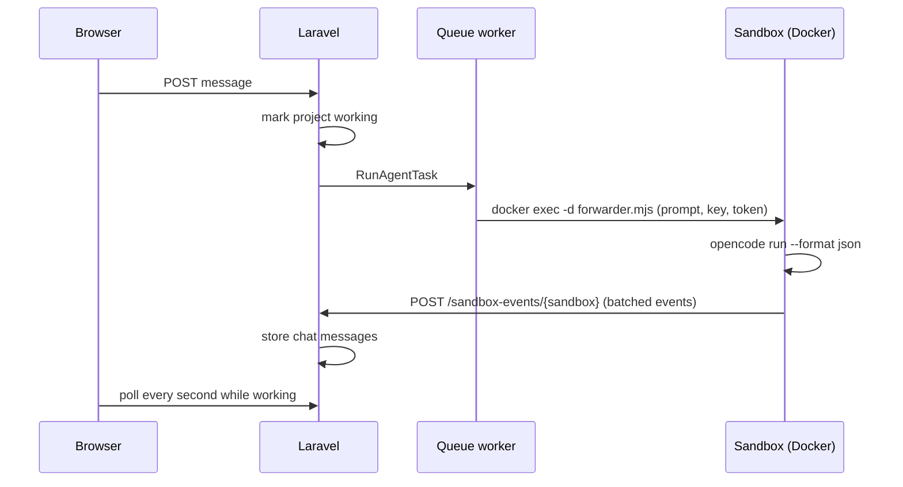

OneDrop is a Laravel 13 application (Inertia + React) that coordinates work happening elsewhere. It follows one rule: **Laravel never holds a long-lived connection or supervises a process.** Long-running work happens in the sandbox or in short, retried queue jobs.

## Flow of a chat message

## Main pieces

| Piece            | Where                                           | What it does                                                                                                |
| ---------------- | ----------------------------------------------- | ----------------------------------------------------------------------------------------------------------- |
| Sandbox provider | `app/Sandbox/SandboxProvider.php`, `Providers/` | Creates, execs in, and destroys sandboxes. `DockerSandboxProvider` locally, `FakeSandboxProvider` in tests. |
| Agent runner     | `app/Sandbox/Agents/OpenCodeRunner.php`         | Starts the forwarder in the sandbox with the user's key and a per-run secret.                               |
| Forwarder        | `docker/sandbox/forwarder.mjs`                  | Runs OpenCode and POSTs its JSON events to OneDrop in order.                                                    |
| Event translator | `app/Sandbox/Agents/OpenCodeEvents.php`         | Turns OpenCode events into chat lines ("Creating src/App.tsx", replies, errors).                            |
| Host proxy       | `docker/sandbox/host-proxy.mjs`                 | Rewrites Host, Origin, and Referer to `localhost` so any dev server accepts preview and published requests. |
| Publisher        | `app/Sandbox/Publishing/TailscalePublisher.php` | Runs a Tailscale container per published project.                                                           |
| Jobs             | `app/Jobs/`                                     | `CreateSandbox`, `RunAgentTask`, `PublishProject`, `ConfirmPublication` (retries while Tailscale comes up). |

## Security

- AI keys are encrypted at rest and injected into sandboxes as environment variables by name
- Agent events are accepted only with the sandbox's current secret token, stored as a hash
- File reads are limited to `/workspace` and run without a shell
- Invite tokens are stored encrypted, looked up by hash
- Preview and shell ports are bound to `127.0.0.1`

## Not built yet

See `README.md` for the full plan. Notable gaps: managed sandbox providers (E2B, Daytona), pausing idle sandboxes and waking them on request, production builds for publishing, and real-time updates over WebSockets instead of polling.
