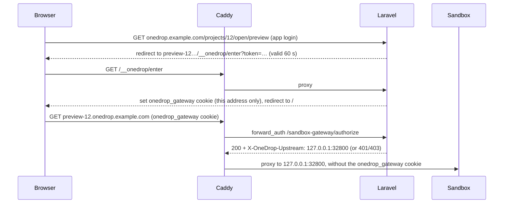

On a laptop, the browser reaches each sandbox directly on `127.0.0.1`. On a server, sandboxes still listen only on `127.0.0.1`, and Caddy serves them at public HTTPS addresses:

| Address                         | Goes to                                             |
| ------------------------------- | --------------------------------------------------- |
| `preview-<sandbox id>.<domain>` | The project's app, through the sandbox's host proxy |
| `shell-<sandbox id>.<domain>`   | The project's web terminal                          |

Turn this on by setting `SANDBOX_GATEWAY_DOMAIN` to your domain. The install script does this for you.

## How each request is checked

- The app's login cookie stays on the app's own host. Code in a sandbox never sees it, and a sandboxed app's own cookies (a Laravel app's `laravel-session`, say) can't clash with it
- The workspace opens previews and shells through `/projects/<id>/open/<kind>`, which hands the browser a short-lived token for that one address. The address trades it for its own `onedrop_gateway` cookie, valid for 12 hours
- Laravel checks that cookie and only allows users who can see the project
- Caddy strips any `X-OneDrop-Upstream` header sent by the browser, so a client can't choose where requests go
- Certificates are only issued for `preview-<id>` and `shell-<id>` hosts of sandboxes that exist
- The `/sandbox-gateway/*` endpoints are blocked on the public site; only Caddy calls them

## Settings

| Variable                 | Description                                                                        |
| ------------------------ | ---------------------------------------------------------------------------------- |
| `SANDBOX_GATEWAY_DOMAIN` | Domain for preview and shell addresses. Empty on a laptop.                         |
| `SANDBOX_CALLBACK_URL`   | How sandboxes report agent events. On a server, the public `APP_URL`.              |
| `SANDBOX_DOCKER_RUNTIME` | Optional container runtime, such as `runsc` for gVisor isolation.                  |
| `AUTH_VERIFY_EMAIL`      | Set to `false` when the server can't send email; new accounts are marked verified. |
